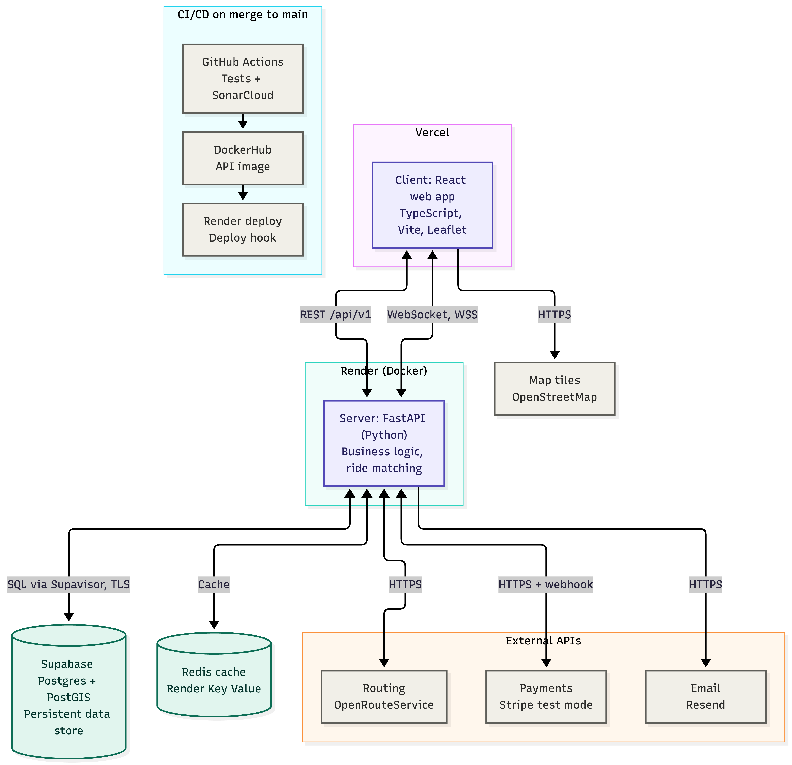

## Product Vision

***BisonRides*** helps reduce carbon emissions and traffic congestion by allowing multiple people to share a single ride. It also provides a more budget-friendly transportation option for university students and others travelling to or from the university. Some people may feel uncomfortable using public transit, making ridesharing a useful alternative. In addition, ***BisonRides*** can also save time being wasted by providing more direct routes compared with public transit, which may require multiple stops or transfers. Additionally, since public transit is not available everywhere, particularly for people who live outside the city, ***BisonRides*** can provide greater transportation accessibility for these individuals.

***BisonRides*** is intended specifically for Univeresity of Manitoba students commuting to campus, and will include checks to confirm that only registered students are able to register onto the platform.

## Initial non-functional expectations

- **Performance**: Usable speeds. Embedded map and algorithms should not be noticable bottlenecks in frontend and backend performance respectively.

- **Reliability**: Should work reliably without crashing.

- **Security**: Safe storage of credentials/secrets. Especially payment information and user email lists.

- **Accessibility**: Follow best practices i.e. alt text on any image.

- **Availability**: Render loads in 1 minute. Should be usable from both mobile and desktop devices.

## Initial technology and platform decisions

- Deploy backend onto **Render** 

- Use **Supabase** for the DB 

- Deploy frontend website onto **Vercel** 

- **Vite**, **TS** to build frontend 

- **Resend** for sending emails or **Twilio** for sending SMSs 

- **GitHub Actions** for CI/CD pipelines, 

- **Sonar Cloud** on PR, Push 

- **Trivy** maybe on PR, Push 

- CD with **Docker** (render deploys image) 

- **Leaflet** to visualize the map on the frontend 

- **Openrouteservice** API for map calls 

- **Python**, (**Flask** or **FastAPI**) with **SQLAlchemy** 

- **Stripe** for payments 

- Caching (**Redis**) 

- **JWT** for authenticating in the frontend 

## Lightweight Architecture Sketch

## Additional process or protocol documentation

- 2 people review any PR before merge 

- Issues are dev tasks

- Branches resolve designated issues 

- `main` branch, `dev` branch, issue branches split from `dev` branch, infrequently carefully merge `dev` into `main` 

- `main` should always be a stable product

- Assign self to user stories with deadlines 

- Discussing tasks that need to get done on *Discord*, once decided self-assign those tasks on github 

- Create new issues as needed and assign to whoever makes sense and is available 

- Bigger issues can be discussed on *Discord* 